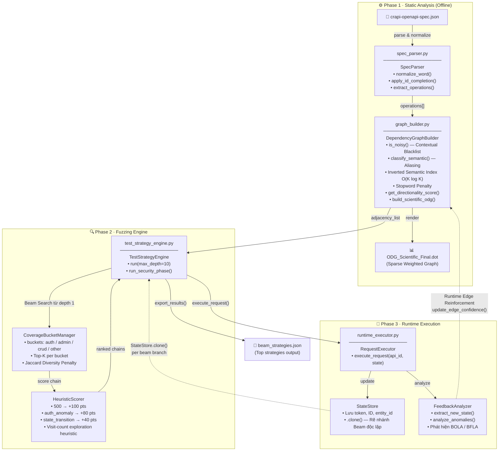

# Kiến trúc Hệ thống: Hybrid Stateful API Fuzzer

## Sơ đồ Tổng thể (System Architecture)

---

## Sơ đồ Luồng Dữ liệu (Data Flow — Mermaid)

---

## Mô tả từng Module

| File | Class chính | Vai trò |
|------|-------------|---------|
| `spec_parser.py` | `SpecParser` | Đọc OpenAPI JSON, chuẩn hóa tên field (Id Completion, Stemming), trả về `operations[]` |
| `graph_builder.py` | `DependencyGraphBuilder` | Xây dựng Sparse Weighted ODG bằng Inverted Semantic Index, Stopword Penalty, Directionality Scoring |
| `test_strategy_engine.py` | `TestStrategyEngine` | Điều phối Beam Search, coverage bucket và pha kiểm thử bảo mật |
| `runtime_executor.py` | `RequestExecutor` | Gửi HTTP thật, rẽ nhánh StateStore, phân tích response |

## Các cơ chế cốt lõi

### 1. Inverted Semantic Index (O(K log K))
Thay vì duyệt O(N² × F²), `DependencyGraphBuilder` **băm field vào semantic bucket** (`identity`, `auth/workflow`, `finance`) trước. Chỉ các field trong cùng bucket mới được so sánh chéo.

### 2. Beam Search từ độ sâu đầu tiên
`TestStrategyEngine.calculate_adaptive_bfs_threshold()` hiện trả về cố định `0`. Vì vậy coverage bucket và giới hạn beam được áp dụng ngay từ depth 1 để khống chế bùng nổ tổ hợp.

### 3. Visit-count Exploration Heuristic
Mỗi node được gắn `visit_count`. Score của node = `base_score + 50 / √visit_count`. Đây là heuristic ưu tiên node ít được thăm, không phải triển khai đầy đủ MCTS/UCT.

### 4. Stateful Beam Branching
Khi Beam rẽ nhánh sang API tiếp theo, `StateStore.clone()` tạo ra **bản sao bộ nhớ độc lập** cho nhánh đó. Các token/ID không bị lẫn lộn giữa các chuỗi tấn công song song.

### 5. Runtime Edge Reinforcement
`DependencyGraphBuilder.update_edge_confidence(api_out, api_in, success)` tự động **điều chỉnh trọng số cạnh** trong đồ thị dựa trên kết quả thực thi:
- Thành công → `confidence × 1.1`
- Thất bại → `confidence × 0.8`

---

## Đầu ra (Outputs)

| File | Nội dung |
|------|----------|
| `ODG_Scientific_Final.dot` | Đồ thị phụ thuộc dạng Graphviz (có màu theo semantic type) |
| `beam_strategies.json` | Các chuỗi API tấn công tốt nhất, kèm score & final_state |
